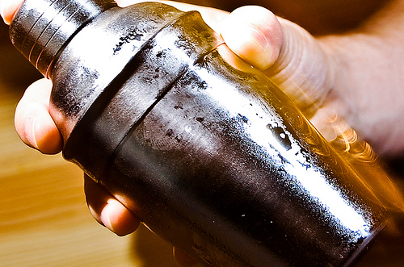

==================
Introducing Shaker
==================

    `Image Source <http://www.flickr.com/photos/breatheindigital/4623226056/>`_

Shaker is a powerful static asset manager for Mojito applications. It gives users absolute control in transforming, validating, uploading, organizing, and combining resources in order to build robust applications and maximize performance.

Shaker provides contextualization of resources in order to serve different resources based on dimensions such region, language, and device. The user can specify custom or default tasks such as JS/CSS minification and linting for transforming and validating resources. These resources can then be combined (or rolled up) in order to reduce HTTP requests and take advantage of caching. And finally resources can be uploaded to one or more CDN locations to optimize the delivery of resources to clients.

Table of Contents
#################

.. toctree::
   :maxdepth: 2

   shaker_overview
   shaker_starting
   shaker_configuration
   shaker_organization
   shaker_components

