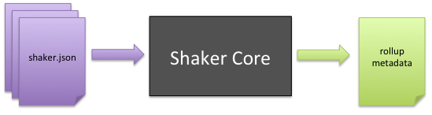
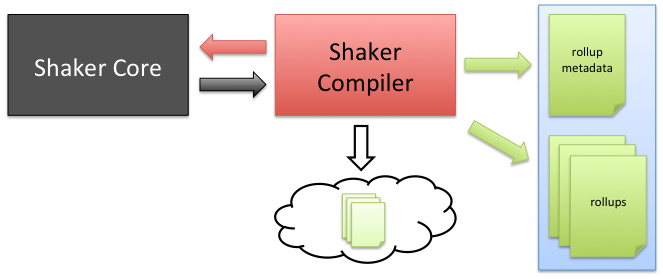

=================
Shaker Components
=================

Shaker is comprised of three components that work together in various ways depending on
the environment. This chapter provides an nontechnical overview focusing on
the three components and how they work together.

.. _shaker_components-core:

Shaker Core
###########

Shaker Core is the foundation of Shaker. It alone has the ability to parse ``shaker.json``
configuration files, compute and resolve rollup dimensions and dependencies, and
ultimately generate rollup metadata.

.. _shaker_components-compiler:

Shaker Compiler
###############

The Shaker Compiler is the build-time component of Shaker. It uses Shaker Core to
generate the metadata and to create the rollups for the application.

Shaker Compiler can be configured for each environment (staging, test, production) in
``application.json``, and you can also decide what actions to apply to the
rollups (minify, js/css lint, etc). Moreover, you can set what we call *deployment tasks*,
which allow developers to deploy rollups to different places:

- ``raw`` - Deploy the assets without doing rollups. This mode will pick the files
  directly from disk (handy for development).

- ``local`` - Compile rollups and output files locally.

- ``s3`` - Compile rollups and upload them to Amazon S3 CDN.

.. note:: Shaker Compiler has nothing to do with any Cocktails product; it is just a name
          of a Shaker internal component.

.. _shaker_components-addon:

Shaker Addon and ShakerHTMLFrame
################################

The Shaker Mojito addon is the runtime component of Shaker. It reads the metadata
generated by the Shaker Compiler, and subsequently, manages assets within the application,
picking the correct rollup based on the current environment.

The ShakerHTMLFrame is a copy of the Mojito HTMLFrameMojit, but it additionally includes
the addon and executes Shaker automatically.

.. _shaker_components-together:

Putting The Pieces Together
###########################

This is how all the components work together:

.. _components_together-build_time:

Build time
----------

#. The ``shaker`` command gets executed, invoking Shaker Compiler.
#. Shaker Compiler gets the application configuration and calls Shaker Core.
#. Shaker Core analyzes all the application resources and returns a metadata object with
   all the information necessary to create the rollups.
#. Shaker Compiler takes the previously generated metadata, generates the minified
   precomputed rollups, and outputs them as files or to a CDN.
#. Shaker Compiler outputs a new metadata file which will be picked up at runtime to
   use the correct rollup based on the context.

.. _components_together-runtime:

Runtime
-------

#. The Mojito server automatically selects the generated metadata file.
#. When a request arrives, Mojito computes everything normally until it reaches the
   ShakerHTMLFrame. Then the Shaker Addon gets executed.
#. Shaker Addon checks the current context and the executed mojits and chooses from the
   metadata the proper rollup to include in the page, overriding the required default
   Mojito assets.
#. All resources are deployed transparently to the developer.
