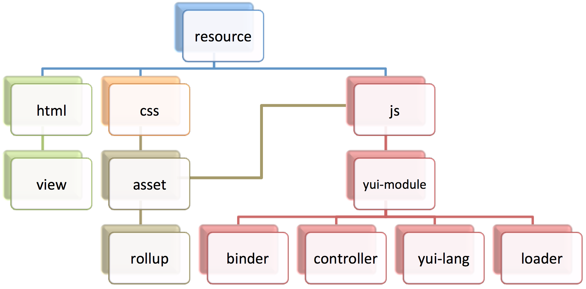

.. _configuration:

=====================
Configuration and API
=====================

Shaker can be configured through the "shaker" option in application.json. Shaker's behavior can be customized per context by
defining the "shaker" option under multiple context settings. See `Using Context Configuration <http://developer.yahoo.com/cocktails/mojito/docs/topics/mojito_using_contexts.html#setting>`_
in the `Mojito Documentation <http://developer.yahoo.com/cocktails/mojito/docs/>`_.

Shaker HTML Frame
=================

Shaker uses a specialized version of Mojito's `HTML frame <http://developer.yahoo.com/cocktails/mojito/docs/topics/mojito_frame_mojits.html>`_.
The specialized frame, ShakerHTMLFrameMojit, must be specified in application.json.

.. code-block:: javascript

    {
        "settings": [ "master" ],
        "specs": {
            "htmlframe": {
                "type": "ShakerHTMLFrameMojit",
                "config": {
                    "deploy": <true_or_false>,
                    "title": "<optional_title>",
                    "child": {
                        <required_child_configuration>
                    }
                }
            }
       }
    }

Default Configuration
=====================

By default, Shaker assumes the configuration below. The user only needs to specify options that differ from the defaults.

.. code-block:: javascript

    {
        "settings": ["master"],
        "shaker": {
            "resources": {
                "assets": {
                    "js": true,
                    "css": true
                },
                "binders": true,
                "controllers": true,
                "views": true,
                "langs": true
            },
            "tasks": false,
            "rollups": false,
            "locations": false,
            "settings": {
                "serveLocation": "default",
                "serveJs": {
                    "position": "top",
                    "combo": false
                },
                "serveCss": {
                    "position": "top",
                    "combo": false
                }

            }
        }
    }

Compilation Options
===================

There are four compilation options, "resources", "tasks", "routeRollups", and "locations". All these options are optional and give the user absolute
control on which resources to process, how to transform/combine them, and where to store them. If any of the options is changed then the Shaker compiler
must be ran (see :ref:`Running Shaker <gs-running>`). If any resource change then a re-compilation may be necessary
(see :ref:`When to Run Shaker Compiler <gs-when>`).

Resources
---------

The "resources" option specify which type of resources to process. If a property is set to false, then that type of resource
is ignored by the Shaker compilation and is handled in Mojito's default manner.

+---------------------------+------------------+---------------+----------------------------------------------------------+
| Property                  | Value Type       | Default Value | Description                                              |
+===========================+==================+===============+==========================================================+
| ``assets``                | boolean/object   | true          | Whether to include application or mojit level assets.    |
|                           |                  |               | Further configuration can be defined through an object   |
|                           |                  |               | (see :ref:`Assets Configuration <configuration-assets>`).|
+---------------------------+------------------+---------------+----------------------------------------------------------+
| ``binders``               | boolean          | true          | Whether to process binders.                              |
+---------------------------+------------------+---------------+----------------------------------------------------------+
| ``controllers``           | boolean          | true          | Whether to process controllers.                          |
+---------------------------+------------------+---------------+----------------------------------------------------------+
| ``views``                 | boolean          | true          | Whether to process views.                                |
+---------------------------+------------------+---------------+----------------------------------------------------------+
| ``langs``                 | boolean          | true          | Whether to process language modules.                     |
+---------------------------+------------------+---------------+----------------------------------------------------------+

.. _configuration-assets:

Assets Configuration
####################

+---------------------------+------------------+---------------+--------------------+--------------------------------------------------------+
| Property                  | Value Type       | Default Value | Possible Values    | Description                                            |
+===========================+==================+===============+====================+========================================================+
| ``js``                    | boolean/string   | true          | boolean, "inline"  | Whether to include application or mojit level JS       |
|                           |                  |               |                    | assets. If "inline" is specified, then all JS assets   |
|                           |                  |               |                    | will be inlined.                                       |
+---------------------------+------------------+---------------+--------------------+--------------------------------------------------------+
| ``css``                   | boolean/string   | true          | boolean, "inline"  | Whether to include application or mojit level CSS      |
|                           |                  |               |                    | assets. If "inline" is specified, then all CSS assets  |
|                           |                  |               |                    | will be inlined.                                       |
+---------------------------+------------------+---------------+--------------------+--------------------------------------------------------+

.. note:: Inlined assets can be disabled during runtime through the "settings" option (see :ref:`Settings <configuration-settings>`).

.. _configuration-tasks:

Tasks
-----

The "tasks" option specifies the list of tasks that should be applied to each type of resource. This option is a map where each key is a
resource type and the value is a map of task modules that will be applied to each resource that matches the type. The keys of this map
is the name of the task module and each value is a configuration object (a false value disables the task,
a true value is the equivalent of an empty configuration object).

Example
#######

.. code-block:: javascript

    "tasks": {
        "js": {
            "jslint": true,
            "jsminify": {
                "squeeze": true,
                "mangle": true
            }
        },
        "css": {
            "csslint": true,
            "cssminify": {
                "yuicompress": true
            }
        }
    }

If more than one resource type specified matches a particular resource, then the most specific type is used. The most specific type is determined
through the type hierarchy shown below. Any of the resource type below is valid.

.. note:: Since both rollup and loader type resources are generated during compilation, they each respectively have default rollup and
         loader tasks predefined. Rollups have a empty list of tasks and loaders are only js-minified. To overwrite this behavior,
         explicitly specify custom rollup and loader tasks.

Predefined Task Modules
#######################

+---------------------------+------------------+------------------------------------------------------------------+
| Task                      | Value Type       | Description                                                      |
+===========================+==================+==================================================================+
| ``jslint``                | boolean/object   | Performs jslint validation. Uses                                 |
|                           |                  | `jslint <https://github.com/reid/node-jslint>`_ node module.     |
+---------------------------+------------------+------------------------------------------------------------------+
| ``jsminify``              | boolean/object   | Performs minification of js files. Uses                          |
|                           |                  | `uglify-js <https://github.com/mishoo/UglifyJS>`_ node module.   |
|                           |                  | Options Include:                                                 |
|                           |                  |   - squeeze (boolean): does various optimizations that result    |
|                           |                  |     in smaller, less readable code.                              |
|                           |                  |   - mangle (boolean): whether to mangle variable names           |
+---------------------------+------------------+------------------------------------------------------------------+
| ``csslint``               | boolean/object   | Performs csslint validation. Uses                                |
|                           |                  | `csslint <https://github.com/stubbornella/csslint>`_ node module.|
+---------------------------+------------------+------------------------------------------------------------------+
| ``cssminify``             | boolean/object   | Performs minification of css files. Uses                         |
|                           |                  | `'less' <https://github.com/cloudhead/less.js>`_ node module.    |
|                           |                  | Options Include:                                                 |
|                           |                  |   - yuicompress (boolean)                                        |
+---------------------------+------------------+------------------------------------------------------------------+

See :ref:`Error Handling <configuration-errors>` for error handling configuration.

.. note:: If any task transform resources, then at least one location should be defined under "locations", otherwise transformed
          resources would not be stored. See :ref:`Locations <configuration-locations>`.

See :ref:`Creating Custom Tasks <custum-tasks>` to learn how to create custom tasks modules.

.. _configuration-rollups:

Route Rollups
-------------

The "routeRollups" option specifies a rollup module that is used to combine resources after tasks have been applied. Each output
rollup is associated with an application route (Shaker loads the rollup for pages matching this route). Only one rollup module
can be specified. Rollups are useful for reducing HTTP requests by combining the most common assets for a particular route. Rollups can take
advantage of browser caching such that subsequent page requests load rapidly since the most common resources are cached.

Predefined Rollup Module: 'mojitrollup'
#######################################

+---------------------------+------------------+--------------------------------------------------------------------------------------+
| Route Rollup              | Value Type       | Description                                                                          |
+===========================+==================+======================================================================================+
| ``mojitrollup``           | object           | Creates css and js rollups for each specified route, which including all resources   |
|                           |                  | in the mojit actions specified and application level assets.                         |
|                           |                  | Resources specifically specified to be ignored through the "resources" option will   |
|                           |                  | not appear. All yui-modules will include all levels of dependencies in the rollup.   |
+---------------------------+------------------+--------------------------------------------------------------------------------------+

Mojitrollup Configuration
#########################

+---------------------------+------------------+--------------------------------------------------------------------------------------+
| Property                  | Value Type       | Description                                                                          |
+===========================+==================+======================================================================================+
| ``<route>``               | array<string>    | Each element in the array follows the pattern "<mojit_name>" or                      |
|                           |                  | "<mojit_name>.<mojit_action>". If no action is specified, then assets of all actions |
|                           |                  | are included.                                                                        |
+---------------------------+------------------+--------------------------------------------------------------------------------------+

Example
#######

.. code-block:: javascript

    "routeRollups": {
        "module": "mojitrollup",
        "rollups": {
            "<route1>": [
                "<Mojit1>",
                "<Mojit2.action1>",
                "<Mojit2.action2>"
            ],
            "<route2>": [
                "<Mojit1.action3>"
            ]
        }
    }

.. note:: If "routeRollups" is defined, then at least one location must be defined under "locations", in order to store the generated rollups
         (see :ref:`Locations <configuration-locations>`).

See :ref:`Creating custom Route Rollups <custom-rollups>` to learn how to create custom route rollup modules.

.. _configuration-locations:

Locations
---------

The "locations" option lists the different locations that will be used to store the processed resources and rollups. To set the location
that is used during runtime set the "serveLocation" under "settings" (see :ref:`Settings <configuration-settings>`). The "locations" option is a map, where each key
is a location module and the value is a configuration object (a false value disables the location, a true value is the
equivalent of an empty configuration object).

Predefined Location Module: 'local'
###################################

+---------------------------+------------------+--------------------------------------------------------------------------------------+
| Location                  | Value Type       | Description                                                                          |
+===========================+==================+======================================================================================+
| ``local``                 | boolean          | Stores processed resources and rollups under "<app_dir>/assets/compiled".            |
+---------------------------+------------------+--------------------------------------------------------------------------------------+

See :ref:`Error Handling <configuration-errors>` for error handling configuration.

Example
#######

.. code-block:: javascript

    "locations": {
        "local": true,
        "<custom_module>": {
            <custom_module_config>
        }
    }

See :ref:`Creating Custom Locations <custom-locations>` to learn how to create custom tasks modules.

.. _configuration-errors:

Error Handling
---------------

By default each task or location is considered non-critical, which means that if a particular task or location fails, there will be
a warning but compilation will continue. However there might be tasks or locations that are critical and compilation would not make sense if they fail.
To make sure compilation stops due to an error, specify the option 'errorStop' as true under the task's or location's configuration.
'errorStop' can also be an integer value, specifying how many errors can occur before compilation is forced to stop.

Runtime Settings and API
========================

There is only one runtime option, "settings". This option can be modified without the need of re-compilation.

.. _configuration-settings:

Settings
--------

The "settings" object is only used during runtime and allows the user to customize how assets should be deployed, without the need of re-compiling.

+---------------------------+------------------+---------------+--------------------------------------------------------------------------------------+
| Property                  | Value Type       | Default Value | Description                                                                          |
+===========================+==================+===============+======================================================================================+
| ``serveLocation``         | string           | "default"     | Whether to include application or mojit level js assets.                             |
+---------------------------+------------------+---------------+--------------------------------------------------------------------------------------+
| ``serveJs``               | boolean/object   | true          | Whether to serve JS resources. See :ref:`ServeJs Configuration <configuration-serve>`|
|                           |                  |               | for object configuration.                                                            |
+---------------------------+------------------+---------------+--------------------------------------------------------------------------------------+
| ``serveCss``              | boolean/object   | true          | Whether to serve CSS assets. See :ref:`ServeCss Configuration <configuration-serve>` |
|                           |                  |               | for object configuration.                                                            |
+---------------------------+------------------+---------------+--------------------------------------------------------------------------------------+
| ``inline``                | boolean          | true          | Whether to serve inline assets. See                                                  |
|                           |                  |               | :ref:`Assets Configuration <configuration-assets>`                                   |
|                           |                  |               | for how to inline all css or js assets during compilation.                           |
+---------------------------+------------------+---------------+--------------------------------------------------------------------------------------+

.. _configuration-serve:

ServeJs and ServeCss Configuration
##################################

+---------------------------+------------------+---------------+-------------------+--------------------------------------------------------+
| Property                  | Value Type       | Default Value | Possible Values   | Description                                            |
+===========================+==================+===============+===================+========================================================+
| ``position``              | string           | "top"         | "top", "bottom"   | Where on the page to position the type of asset.       |
+---------------------------+------------------+---------------+-------------------+--------------------------------------------------------+
| ``combo``                 | boolean          | false         | boolean           | Whether to combo-load the type of asset.               |
|                           |                  |               |                   | Note: rollups are not comob-loaded since               |
|                           |                  |               |                   | they should be cached separately for performance.      |
+---------------------------+------------------+---------------+-------------------+--------------------------------------------------------+

Runtime API
-----------

Shaker provides a runtine API to modify the behavior of Shaker per request. To use the Shaker API include "mojito-shaker-addon". To use
the shakerInline API include "shaker-inline-addon".

+---------------------------+----------------------------------+---------------------+------------------------------------------------------------+
| API                       | Arguments                        | Returns             | Description                                                |
+===========================+==================================+=====================+============================================================+
| shaker.set                | [string, boolean/string/object]  | The value set, null | Sets property under "settings" or html data. Valid html    |
|                           |                                  | if error.           | data include "title", "html_class", and "html_attributes". |
+---------------------------+----------------------------------+---------------------+------------------------------------------------------------+
| shaker.get                | [string]                         | The value of the    | Gets the property value, valid properties correspond to    |
|                           |                                  | the property, null  | properties that can be set as described above.             |
|                           |                                  | if no such property.|                                                            |
+---------------------------+----------------------------------+---------------------+------------------------------------------------------------+
| shakerInline.inlineFile   | [string[, type ("css" or "js")]] | Boolean, whether    | Inlines a particular application level asset. See          |
|                           |                                  | the file was found. | :ref:`Inlining Using inlineFile <organization-inlineFile>`.|
+---------------------------+----------------------------------+---------------------+------------------------------------------------------------+
